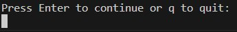

# Console Battleship Game

## Introduction
Welcome to the Console Battleship Game, an exciting battle brought to life in your console! This Python-based game pits you against a computer opponent in a strategic showdown on the high seas.


You can play this game at [https://pbrdys-battleship-game-e5bf19d085e1.herokuapp.com/](https://pbrdys-battleship-game-e5bf19d085e1.herokuapp.com/)

## How to play
You open the link above to open the python based console battleship application within the web browser. 
The first thing you will see is a welcoming screen wether you can choose to start the game or end it 
immediately.

* Choose '1' to start or '2' to end the game.
* You decided to play the game and the boards of both players (player 1 and computer) are being displayed.
* Ships are only being displayed on the player's board. On the computer's board the ships are hidden.
    * There are different ships with different lengths available in this game. (More information in the [ShipType Section](#ShipType)).
* You (Player 1) has the first turn.
* Choose an x-coordinate and an y-coordinate to attack the opponents board.
    * Coordinates can only be numbers within the board range.
* Turn change: computers turn, computer attacks.
* After both players made their attacks, you can choose wether to continue or quit the game. 
* You continue the game and the updated boards are being displayed:
    * Hits are displayed as an green "X"
    * Miss is being displayed as an red "/"
    * Ships are being displayed as an yellow number (2 - 5)
* Both players go like that back and forth until the game is over. 
    * Game end: After both players attacked and you decide to quit the game
    * Game end: After one player has destroyed all ships of the opponent.
        * Once a winner is determined, the user will have the option to replay the game or choose to exit.

## Features
### Existing Features

#### Welcome Screen


At the start of the game users are welcomed and introduced to the game they are about to play.
The user can see a menu where he can chose if he wants to start or end the game. In order to start the game the user has to enter "1". He can also enter "2" to end the game. Any other values will resolve in an error message.

### Display Player Boards
After the game was started the first thing the user will see are the boards of both players (player 1 and computer). 


On the players board the ships are being displayed with yellow numbers. 
The number is referring to the length of the ship.


The initial computer board is displayed with empty cells. The ships must be hidden for the player. 

Both boards are being [updated](#Update-Player-Boards) after they have been attacked.

### Place Ship
The ships are being placed randomly for both players.
The criteria to place a ship are:
* Ships are not allowed to share the same coordinate (they shouldn't cross each other)
* Ships must fit into the boards width and height. 

### Play turn
Player 1 starts the game. Player 1 is choosing his coordinates to attack the computers board. 
The criteria to match for the coordinates are:
* Coordinates must be a valid integers within the board size. Starting with the index of 0. 
* No other values are permitted (e.g. strings, booleans, etc.)

Entering invalid value results in an proper [error message](#Display-Error-Messages).


In the next turn the computer is about to attack the players board.
The coordinates for the computer are being generated randomly.


Like this both players play their turns back and forth until the game is over.

### Attack The Opponents Board
Each turn a player is about to attack the opponents board by choosing the coordinates for his attack as described in the section [Play turn](#Play-turn).

After a player has attacked the opponent's board, he receives an information message indicating whether he **hit** or **missed**.

#### Hit


#### Miss


### Continue or Quit the Game
After both players made their attack the user is being prompted to choose wether to **continue** or **quit** the game.


### Update Player Boards
The updated player boards contain:
* Player 1:
    * displaying **ships** as **numbers** (**yellow**)
    * displaying **hits** as **X** (**green**)
    * displaying **miss** as **/** (**red**)


* Computer:
    * displaying **hits** as **X** (**green**)
    * displaying **miss** as **/** (**red**)


### End the game 
There are three ways to end the game.
The first two are either in the beginning when the [Welcome Screen](#Welcome-Screen) is being displayed, 
or after every second turn. Basically always after the computer made his attack, the player can chose wether he wants to continue the game or end the game. 

#### End Game before you even start: 


To end the game at the welcome screen the player has to chose **2**. 

#### End Game during the game: 


To end the game during the game, the player has to chose **q** to quit. 

### Determine the winner
The third way to end the game is by winning or losing the game. After both players have played turn by turn against each other, the player who first has destroyed all ships of his opponent wins the game.


In the moment the last ship was destroyed, the winner is being displayed and the game is over. 

### Replay game
Once a winner is determined, users will have the option to replay the game or choose to exit.


### Display Error Messages
Error messages play a crucial role in enhancing the gameplay experience as they provide users with feedback on their actions. This information helps users understand what is happening and guides them on the necessary steps. Additionally, effectively catching errors and delivering appropriate messages prevents the application from crashing.

#### Warning: Already attacked coordinates
When the user attempts to attack the same coordinate again, a relevant message is displayed, prompting the user to select different coordinates for their next attack.


#### Error: Coordinates out of range
When the user attempts to attack coordinates that are not within the range (width, height) of the opponents board, a relevant message is being displayed, prompting the user to select different coordinates.
* X-Coordinate: between 0 and max-board-width
* Y-Coordinate: between 0 and max-board-height


#### Error: Invalid coordinates
When the entered coordinates don't match the criteria, a relevant message is displayed, prompting the user to select different coordinates for their next attack. 
* Coordinate criteria: 
    * Only numbers allowed, no strings or other values


#### General Exception-Handling
In certain scenarios, the application may encounter unforeseeable input values. To safeguard against potential crashes, it is imperative to establish a comprehensive high-level exception handling mechanism at the application's core. This overarching exception handling will address any errors that may arise and are not specifically caught elsewhere within the application.


## Future Features
* Playing against another human
* Implement smarter strategies for attack coordinates of the computer. For instance, after a successful hit, the next set of coordinates could be chosen from the adjacent cells of the previous hit, optimizing the computer's targeting approach.
* Dynamic player name and board size.

## Data Model
I utilized an Object Orientated Programming approach to developing the game.
The initial file is the **run.py** which is calling:
```python
    if __name__ == "__main__":
        main()
```

The **main()** function is responsible to establish the whole game.
It is starting the game by creating a new **Game** instance, placing ships on the boards of both players and displaying the initial boards. 

### UML Diagram


#### Game Class
The Game class represents the overall structure and logic of a Battleship game. 

* __init__(self)
    * Initializes a Battleship game with two players.
    * Sets initial turn counter to 0.
* **start_game**(self)
    * Displays a welcome message and game instructions.
    * Allows players to choose between starting the game or ending it.
    * If the game starts, it places ships for both players and displays the initial boards.
* **end_game**(self)
    * Prints a message indicating the player chose to quit the game.
    * Exits the console.
* **place_ships**(self, player)
    * Places ships on the board for the specified player.
* **display_boards**(self)
    * Iterates through each player and displays their board with or without showing ships based on the player's name.
* **play_turn**(self)
    * Increments the turn counter.
    * Displays turn information.
    * Determines the current player based on the turn number.
    * Prompts the current player to make an attack.
    * Displays the result of the attack and checks if any enemy ships have been sunk.
    * Shows a message prompting the player to continue.
* **get_attack_coordinates**(self, current_player)
    * Determines the coordinates for an attack based on the player:
        * For the computer player, generates random attack coordinates.
        * For the human player, prompts for input and validates the coordinates.
* **generate_random_attack_coordinates**(self)
    * Generates random attack coordinates for the computer player.
    * Ensures the generated coordinates have not been attacked before.
* **check_sunk_ships**(self, player)
    * Checks for sunk ships on the board of the specified player.
    * Checks if it was destroyed and prints a message if so.
* **show_continue_message**(self)
    * Displays a message and waits for user input to continue the game.
    * If Enter is pressed, displays player boards and continues.
    * If 'q' is entered, ends the game.

#### Player Class
The Player class represents a player in the Battleship [Game](#Game-Class).

* __init__(self, name, board)
    * Initializes a player with the given name and a game board.

The Player class serves as a container for player-related information, such as the player's name and associated game board. Instances of this class are used in the Game class to represent the two players participating in the Battleship game.

#### Board Class 
The Board class represents a game board in the Battleship game.
The Board is associated to the [Player](#player-class).
The Board class is responsible for managing the state of the game board, placing ships, handling attacks, and displaying the board for players during the game.

* __init__(self, width, height)
    * Initializes a game board with the given width and height.
* **place_ship**(self, ship)
    * Places a ship on the board randomly.
    * Randomly selects an orientation (horizontal or vertical) for the ship.
    * Checks if the ship fits in the chosen orientation and starting position within the board boundaries.
* **receive_attack**(self, x, y)
    * Receives an attack at the specified coordinates (x, y).
    * Checks if the attack coordinates are within the valid board range.
    * Checks if the attack hits any ship on the board:
        * Returns True if the attack hits a ship, False otherwise.
* **display_board**(self, show_ships)
    * Displays the current state of the game board.
    * Uses color-coding to distinguish hits (green), misses (red), and ships (yellow).
* **get_cell_content**(self, x, y, show_ships)
    Gets the content of a cell on the board for display purposes.
* **all_ships_sunken**(self)
    Returns True if all ships are sunk, False otherwise.

#### Ship Class
The Ship class represents a ship in the Battleship game.

* __init__(self, ship_type)
    * Initializes a ship with the given type.

* **is_sunk**(self)
    Checks if the ship is sunk.
    Returns True if all positions occupied by the ship have been hit, returns False otherwise.

The primary purpose of the Ship class is to represent the state of a ship in the game, keeping track of its type, positions, and hits. The is_sunk method is crucial for determining whether a ship is still alive or has been sunk by enemy attacks.

#### ShipType
The ShipType enum defines types of ships in the Battleship game, each associated with a specific length. It is used to represent the different ship types that players can place on the game board.

* There are 4 different ship types are:
    * PATROL_BOAT with the length of 2
    * SUBMARINE with the length of 3
    * BATTLESHIP with the length of 4
    * CARRIER with the length of 5

#### Orientation Class
The Orientation enum defines ship orientations in the Battleship game. It is used to represent whether a ship is placed horizontally or vertically on the game board.
* These are the two possible orientations for a ship:
    * HORIZONTAL
    * VERTICAL


## Flow Diagram
In the following flowchart, the game flow of the Battleship implementation is visually represented. This flowchart outlines the sequence of actions and decisions players and the computer make during the game, providing a high-level overview of the game's logic.


# Testing
Testing the Battleship game code involves verifying that different components and functionalities work as expected.
Here are the ways I chose to test this code, as described below:

## User Input Testing:
To ensure the robustness of user input handling, a series of tests have been designed. Simply start the application and follow the actions described below.

| Description                                                        | Action                                                                                                                                                                                                   | Expected Result                                              | Pass / Fail |
| ------------------------------------------------------------------ | -------------------------------------------------------------------------------------------------------------------------------------------------------------------------------------------------------- | ------------------------------------------------------------ | ----------- |
| The game handles interaction with the welcome screen by user input | Enter valid values (1 or 2)                                                                                                                                                                              | Game is being started or ended                               | Pass        |
| The game handles interaction with the welcome screen by user input | Attempt to enter various values that could potentially cause an error.                                                                                                                                   | Error message is being displayed and the game doesn't crash. | Pass        |
| The game handles chosen attack coordinates by user input           | Enter valid values (integer within the board range)                                                                                                                                                      | Opponents board is being attacked as expected                | Pass        |
| The game handles chosen attack coordinates by user input           | Attempt to enter various values as attack coordinates that could potentially cause an error. Input values such as non-integer characters, negative numbers, or coordinates outside the board boundaries. | Error message is being displayed and the game doesn't crash. | Pass        |
| The game handles quit and continue user input                      | Enter valid values (q or just press ENTER)                                                                                                                                                               | Game is being continued or ended                             | Pass        |
| The game handles quit and continue user input                      | Enter all kind of values that could cause an error                                                                                                                                                       | Error message is being displayed and the game doesn't crash. | Pass        |

## Display and Output Testing:
To verify the correctness and clarity of the display and output, execute the actions described below.

| Description                     | Action                                                | Expected Result                                     | Pass / Fail |
| ------------------------------- | ----------------------------------------------------- | --------------------------------------------------- | ----------- |
| Display: Welcome Section        | Run the application                                   | Welcome Section is being displayed as expected      | Pass        |
| Display: Player Boards          | Start the game                                        | Player Boards are being displayed as expected       | Pass        |
| Display: Updated Player Boards  | Continue the game after attacking the opponents board | Player Boards are being displayed as expected       | Pass        |
| Display Turn                    | Start the game, make attacks, continue the game       | Turn is being incremented and displayed as expected | Pass        |
| Display Attack Result           | Choose coordinates to attack opponents board          | Attack is being displayed as expected               | Pass        |
| Display: Ship Destroyed Message | Ship has been hit at all his coordinates              | Display Ship Destroyed as expected                  | Pass        |
| Display: Winner                 | All ships of the opponent have been destroyed         | Display winner as expected                          | Pass        |

## Debug Testing:
Run debugging tests to ensure the robustness and correct functioning of critical methods within the application.

| Description                                                                | Action                                                                                                                | Expected Result                                                                            | Pass / Fail |
| -------------------------------------------------------------------------- | --------------------------------------------------------------------------------------------------------------------- | ------------------------------------------------------------------------------------------ | ----------- |
| Debugging - Check methods by manipulating parameters and check the result  | Manually manipulate parameters of critical methods (e.g., place_ship) and observe the outcome.                        | Confirms that the method handles manipulated parameters and produces the expected results. | Pass        |
| Debugging - Check methods by observing and verifying correct functionality | Observe the execution of key methods (e.g., receive_attack, check_sunk_ships) and verify that they operate correctly. | Confirms that methods execute without errors and produce expected results.                 | Pass        |

## Validator Testing
CI Python Linter - I utilized [pep8ci.herokuapp.com](https://pep8ci.herokuapp.com/#) to validate my python code. 
All python files were checked with no errors or warnings reported.

* Screenshots of the validator reports are here:
    * [Main](./doc/ci_python_linter_main.jpg)
    * [Board-Class](./doc/ci_python_linter_board.jpg)
    * [Game-Class](./doc/ci_python_linter_game.jpg)
    * [Player-Class](./doc/ci_python_linter_player.jpg)
    * [Ship-Class](./doc/ci_python_linter_ship.jpg)
    * [ShipType-Enum](./doc/ci_python_linter_shiptype.jpg)
    * [Orientation-Enum](./doc/ci_python_linter_orientation.jpg)

# Libraries Utilized

## External Libraries
### colorama 
[colorama](https://pypi.org/project/colorama/) is an external Python library used to add colored output to the terminal. This library enhances the visual representation of text, making the console output more readable and appealing. In the context of the Battleship game, colorama is used to highlight hits, misses, and various messages, enhancing the overall user experience.

#### How to use colorama:
To utilize colorama in your Python script, follow these steps:

* Import the necessary modules:

``` python
    from colorama import Fore, Style
```


* Use **Fore.YOUR_SELECTED_COLOR** to display the following text in your chosen color. Available colors include **RED**, **GREEN**, **YELLOW**, and more.

```python
    print(Fore.GREEN)
    print("This text will be displayed in GREEN")

    print("This text will also be displayed in GREEN")
```

* Use **Style.RESET_ALL** to reset the text color to the default.

```python
    print(Style.RESET_ALL)
    print("This text will now be displayed in the default color (white).")
```


## Built in Python Libraries 
### random 
The random library in Python provides a suite of functions for generating random numbers. In the context of the Battleship game, this library was imported to leverage its built-in methods for generating random selections. The primary application of the random library was observed in the AI shot selection algorithms, where it played a crucial role in choosing random locations for firing.

# Deployment
The site was deployed via Heroku.
The project was developed utilizing a Code Institute provided template.

## Version Control (GitHub)
All files has been committed during the development process to GitHub.
* File Structure: 
    * /classes (all used classes to run this application)
    * requirements.txt (contains all dependencies to run this application)
    * doc (all images used for this documentation)
    * run.py (main file to run this application)

## Git Commands used during the development
    - git add .                                     |       Add all changes to the next commit
    - git commit -m "commit message here"           |       Commit the added changes
    - git push                                      |       Finally push the changes to the git repository

## Project Deployment

### Setting Up Virtual Environment
The deployment process begins by creating a virtual environment **(venv)** on your development machine. Within this virtual environment, essential packages, such as **colorama**, are installed. To ensure that unnecessary files from the **venv** are not uploaded to GitHub, it's crucial to add the virtual environment directory to the .gitignore file.

### Python Essentials Template
The project utilizes the Python Essentials Template, acting as a mock terminal that allows users to experience the Python console application in a web browser. Deployment to Heroku differs from GitHub Pages, and the following steps guide the deployment process:

* **Orderly Input Methods**: It's essential to include a newline character (**\n**) at the end of each input method text. For instance:

``` python
    x = int(input("Enter the x-coordinate for your attack:\n"))
```

* **Requirements List**: Create a list of requirements for your project, specifying dependencies like colorama. Update the requirements.txt file with the command:

``` python
    pip3 freeze > requirements.txt
```

This file informs Heroku about the necessary dependencies to install.

* **GitHub Repository**: Upload all project files to your GitHub repository [GitHub](https://github.com).

* **Heroku Account Setup**:
    * Sign up for a [Heroku](https://www.heroku.com/) account.
    * From the Heroku Dashboard, create a new app by selecting 'New' and then 'Create New App'.
    * Assign a name to the project (e.g., **pbrdys-battleship-game**).
    * Choose a suitable region (e.g., 'Europe').

* **Heroku Settings Tab**:
    * **Config Vars**: No specific config vars are needed for this project.
    * **Buildpacks**: Set up the following buildpacks in this exact order:
        * Install Python
        * Install Nodejs (required for running the mock terminal template)
* **Heroku Deploy Tab**:
    * Deployment Method: GitHub
    * Connect to GitHub and link the repository to your Heroku account.
    * Enable Automatic Deploys for continuous deployment or manually deploy when needed.

By following these steps, your Battleship game will be successfully deployed on Heroku.


# Credits
I used object-oriented programming principles in the creation of this Battleship game. Since the Code Institute courses did not delve deeply into object-oriented programming, I proactively searched for additional learning resources on the internet. Below is a list of tutorials, web pages, and courses that I used to enhance my understanding of object-oriented programming:

* Youtube: Object Oriented Programming with Python - Full Course for Beginners
    * https://www.youtube.com/watch?v=Ej_02ICOIgs&t=3478s
* Object-Oriented Programming (OOP) in Python 3
    * https://realpython.com/python3-object-oriented-programming/
* https://www.python.org/
* https://docs.python.org/3/tutorial/classes.html

I also want to thank Daisy Mc Girr for her support throughout my entire projects so far. 